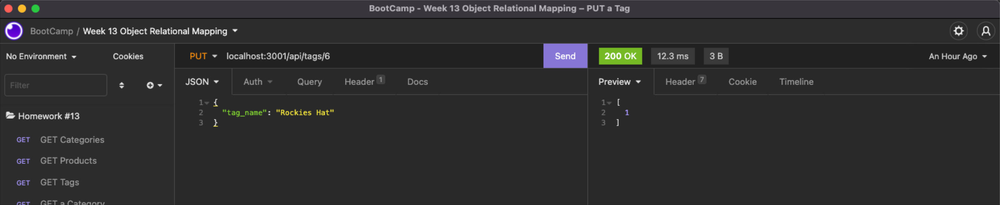

# HOMEWORK #13 - E-Commerce Back End
The E-Commerce Back End code can be found here - 

https://github.com/mtnbiker72/ecommerce-back-end

The video that explains how to use the application -

## Required Modules:
* mysql2
* dotenv
* express
* sequalize

## Description Summary
This app is a back end for an e-commerce site.  It uses express API's and
Sequalize to interact with a MySQL database.

The database is created by sourcing db/schema.sql.
Seed data is in seeds directory.

`Product` belongs to `Category`, and `Category` has many `Product` models, as a category can have multiple products but a product can only belong to one category.

`Product` belongs to many `Tag` models, and `Tag` belongs to many `Product` models. Allow products to have multiple tags and tags to have many products by using the `ProductTag` through model.

## Acceptance criteria

 * Access to database using environment variables (dotenv) 
 * Connect to database using Sequalize
 * Database tables/data are created with model data
 * Using Insomnia, user can:
    - GET a single Category
    - GET a single Tag
    - GET a single Product
    - GET all Categories
    - GET all Tags
    - GET all Products
    - DELETE a single Category
    - DELETE a single Tag
    - DELETE a single Product
    - UPDATE (PUT) a single Category
    - UPDATE (PUT) a single Tag
    - UPDATE (PUT) a single Product
    - POST (create) a Category
    - POST (create) a Tag
    - POST (create) a Product

## Usage
 - update .env file with environment variables

 - create the database - source schema.sql

 - seed the database - npm run seed

 - npm i

 - npm start

## Questions, Contact

 * Github:  https://github.com/mtnbiker72

 * Email: heather.graham@yahoo.com

## Images
            
            
            
            